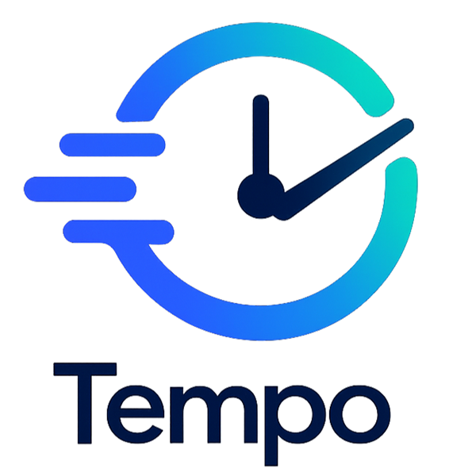

<p align="center">
  
</p>

<h1 align="center">Tempo</h1>

<p align="center">
  A personal day-planning app for freelancers and multi-job professionals — combining AI scheduling, gamification, and a unified calendar in one place.
</p>

---

## What is Tempo?

Tempo is a personal productivity tool built for people juggling multiple clients, jobs, or roles. It pulls your tasks, meetings, and Google Calendar events into a single view, lets Claude generate a tailored daily plan for you, and keeps you motivated with XP, levels, and streaks — all at an individual price point, without the overhead of team-oriented tools.

### Core pillars

| Pillar | Description |
|---|---|
| **Unified daily timeline** | Tasks, meetings, and multi-account Google Calendar events merged into one chronological Today view |
| **AI Day Planner** | Generate a daily plan via Claude and import it as real tasks and meetings — no extra API billing on top of your subscription |
| **Multi-job / multi-account model** | Each job has a color, an optional linked Google account, and tracks time independently |
| **Gamification** | XP, levels, streaks, and unlockable achievements keep daily execution motivating |
| **Focus / Pomodoro timer** | Built-in focus sessions with per-job time tracking |
| **Calendar** | Full day, week, and month views with event modals — tasks, meetings, and Google events all in one grid |

---

## Features

### Today
- Chronological timeline of tasks and meetings for the day
- Google Calendar events from multiple accounts, color-coded per job
- One-click task completion with XP reward toasts
- Activity chart showing productivity across the week

### Tasks
- **List view** — Overdue / Today / Upcoming / Anytime / Completed sections with progress bar
- **Agenda view** — chronological day-by-day layout across ±30–60 days, showing tasks (with full interactions), meetings, and Google events
- AI Plan Import — paste a Claude response and auto-create tasks and meetings

### Schedule (Calendar)
- **Day view** — single-column time grid (6 AM–11 PM), current time indicator, all-day event row
- **Week view** — 7-column grid with per-day highlights, all-day events row, greedy overlap-aware event layout
- **Month view** — full-page month grid with event pills; click a day to drill into day view
- Click any event to open an animated modal with full details (title, time, duration, job, notes, Google Calendar link)

### Meetings
- Create and manage meetings with time, duration, job, and notes
- Shown in Today timeline and all calendar views

### Jobs
- Manage clients/employers with custom colors and optional Google Calendar account linking
- Optional hourly rate for estimated earnings tracking

### Progress
- Weekly stats: XP earned, tasks completed, focus minutes
- XP history chart, level progression, streak tracking

### Achievements
- Unlockable badges tied to milestones — streaks, tasks completed, focus time, XP earned

### Focus Timer
- Pomodoro-style focus sessions tied to a task and job
- Focus minutes logged to daily history and reflected in Progress stats

### Time Tracking
- Per-task and per-job time tracking via a persistent global timer bar
- Weekly time entries surfaced in task rows

### Jira Integration
- Browse and manage Jira issues directly within Tempo
- Convert Jira issues into Tempo tasks

---

## Tech Stack

### Frontend

| Technology | Purpose |
|---|---|
| [React 19](https://react.dev/) | UI framework |
| [Vite 8](https://vitejs.dev/) | Build tool and dev server |
| [Tailwind CSS v4](https://tailwindcss.com/) | Utility-first styling — all layout and visual design |
| JavaScript (ES Modules) | Primary language — no TypeScript |

### Backend

| Technology | Purpose |
|---|---|
| [Node.js](https://nodejs.org/) + [Express](https://expressjs.com/) | REST API server (`/server`) |
| [MySQL2](https://github.com/sidorares/node-mysql2) | Database driver |
| [dotenv](https://github.com/motdotla/dotenv) | Environment configuration |

### External APIs & Integrations

| Integration | Purpose |
|---|---|
| [Google OAuth 2.0](https://developers.google.com/identity/protocols/oauth2) | Authentication and Google Calendar scope authorization |
| [Google Calendar API](https://developers.google.com/calendar/api) | Fetching events across multiple linked accounts |
| [Anthropic Claude API](https://docs.anthropic.com/) | AI Day Planner — generates structured daily plans from natural language |
| [Jira REST API v3](https://developer.atlassian.com/cloud/jira/platform/rest/v3/) | Issue browsing and conversion to Tempo tasks |
| [Linear](https://linear.app/) | Sidebar shortcut to linked Linear workspace |

---

## Component Libraries

### [Lucide React](https://lucide.dev/) &nbsp;·&nbsp; `lucide-react`
Icon set used throughout the entire app for navigation, actions, and status indicators.

```bash
npm install lucide-react
```

Commonly used icons: `CalendarDays`, `Clock`, `Sparkles`, `Trophy`, `Flame`, `Brain`, `ChevronLeft`, `ChevronRight`, `Plus`, `X`, `AlertTriangle`, `Briefcase`, `ExternalLink`, `List`, `CalendarDays`, `CheckCircle2`, and more.

---

### [Framer Motion](https://www.framer.com/motion/) &nbsp;·&nbsp; `framer-motion`
Animation library used to power the animated event detail modal in the calendar.

```bash
npm install framer-motion
```

APIs used:
- `AnimatePresence` — orchestrates mount/unmount animations for the modal backdrop and card
- `motion.div` — spring-animated modal card with scale + fade + y-offset transitions on enter and exit

---

### [MUI Material](https://mui.com/material-ui/) &nbsp;·&nbsp; `@mui/material`
Used for `ThemeProvider` and `createTheme` to propagate the app's dark/light mode into MUI sub-packages (primarily for the charts).

```bash
npm install @mui/material @emotion/react @emotion/styled
```

---

### [MUI X Charts](https://mui.com/x/react-charts/) &nbsp;·&nbsp; `@mui/x-charts`
Data visualization in the Progress tab.

```bash
npm install @mui/x-charts
```

Charts used:
- `BarChart` — weekly XP history
- `SparkLineChart` — compact trend indicators

---

### [Aceternity UI](https://ui.aceternity.com/)
Handcrafted animated React components used on the marketing/login screen and in the app shell. Components are copied into `src/components/ui/` as local files (Aceternity's standard distribution model).

| Component | Local file | Usage |
|---|---|---|
| [Background Beams](https://ui.aceternity.com/components/background-beams) | [`ui/background-beams.jsx`](src/components/ui/background-beams.jsx) | Animated beam gradient on the login screen hero section |
| [Glowing Effect](https://ui.aceternity.com/components/glowing-effect) | [`ui/glowing-effect.jsx`](src/components/ui/glowing-effect.jsx) | Glowing border effect on feature highlight cards |
| [Flip Words](https://ui.aceternity.com/components/flip-words) | [`ui/flip-words.jsx`](src/components/ui/flip-words.jsx) | Animated word cycling in the login screen headline |
| [Resizable Navbar](https://ui.aceternity.com/components/resizable-navbar) | [`ui/resizable-navbar.jsx`](src/components/ui/resizable-navbar.jsx) | Shrinking / collapsing navbar on the marketing screen |
| Animated Modal | [`ui/AnimatedModal.jsx`](src/components/ui/AnimatedModal.jsx) | Spring-animated modal used for calendar event details |

---

### [@react-oauth/google](https://github.com/MomenSherif/react-oauth) &nbsp;·&nbsp; `@react-oauth/google`
Handles the Google OAuth sign-in flow and Calendar scope authorization.

```bash
npm install @react-oauth/google
```

Used: `GoogleOAuthProvider` (app root wrapper), `useGoogleLogin` (sign-in and Calendar account linking).

---

### [react-markdown](https://github.com/remarkjs/react-markdown) &nbsp;·&nbsp; `react-markdown`
Renders AI-generated plan text as formatted markdown in the AI Plan Import panel.

```bash
npm install react-markdown
```

---

### [clsx](https://github.com/lukeed/clsx) + [tailwind-merge](https://github.com/dcastil/tailwind-merge)
Utility helpers for conditional and conflict-free Tailwind class composition.

```bash
npm install clsx tailwind-merge
```

---

## Project Structure

```
tempo-app/
├── src/
│   ├── assets/              # Logos, screenshots, background images
│   ├── components/
│   │   ├── achievements/    # AchievementsTab, AchievementBadge
│   │   ├── auth/            # LoginScreen, SignInScreen
│   │   ├── focus/           # FocusTab (Pomodoro timer)
│   │   ├── jobs/            # JobsTab, JobCard
│   │   ├── jira/            # JiraTab, JiraCard
│   │   ├── layout/          # Sidebar, Toast, GlobalTimerBar, LoadingScreen
│   │   ├── meetings/        # MeetingsTab, MeetingCard
│   │   ├── onboarding/      # OnboardingFlow
│   │   ├── progress/        # ProgressTab (stats + charts)
│   │   ├── schedule/        # ScheduleTab (day/week/month calendar), TimeGrid, MonthCalendar
│   │   ├── settings/        # SettingsTab
│   │   ├── tasks/           # TasksTab (list + agenda views)
│   │   ├── time/            # TimeTab (time tracking history)
│   │   ├── today/           # TodayTab, TaskRow, QuickAdd, AIPlanImport, ActivityChart
│   │   └── ui/              # AnimatedModal, Aceternity components, shared primitives
│   ├── context/             # DataContext — server-synced storage layer
│   ├── hooks/               # useAchievements, useGoogleCalendar, useCalendarAccounts,
│   │                        # useTimeTracking, useAuth, useTheme, useNotifications
│   └── utils/               # helpers.js (dates, XP, formatting), aiPlan.js (Claude prompt builder)
└── server/
    ├── routes/
    │   ├── aiPlan.js        # Anthropic Claude API proxy for AI Day Planner
    │   ├── data.js          # User data CRUD — tasks, jobs, meetings, stats, profile
    │   ├── jira.js          # Jira REST API proxy
    │   └── timeTracking.js  # Focus session and time entry storage
    ├── middleware/auth.js    # JWT verification middleware
    └── db.js                # MySQL2 connection pool
```

---

## Getting Started

### Prerequisites
- Node.js 20+
- MySQL database
- Google OAuth Client ID (for sign-in and Calendar)
- Anthropic API key (for AI Day Planner)

### Install

```bash
# Frontend dependencies
npm install

# Server dependencies
cd server && npm install
```

### Environment

**`server/.env`**
```env
DB_HOST=localhost
DB_USER=your_db_user
DB_PASSWORD=your_db_password
DB_NAME=tempo
ANTHROPIC_API_KEY=sk-ant-...
JWT_SECRET=your_jwt_secret
```

**`.env` (frontend root)**
```env
VITE_GOOGLE_CLIENT_ID=your_google_client_id.apps.googleusercontent.com
VITE_API_URL=http://localhost:3001
```

### Run

```bash
# Run frontend + API server together
npm run dev:all

# Or separately
npm run dev              # Vite — http://localhost:5173
cd server && npm run dev # Express API — http://localhost:3001
```

